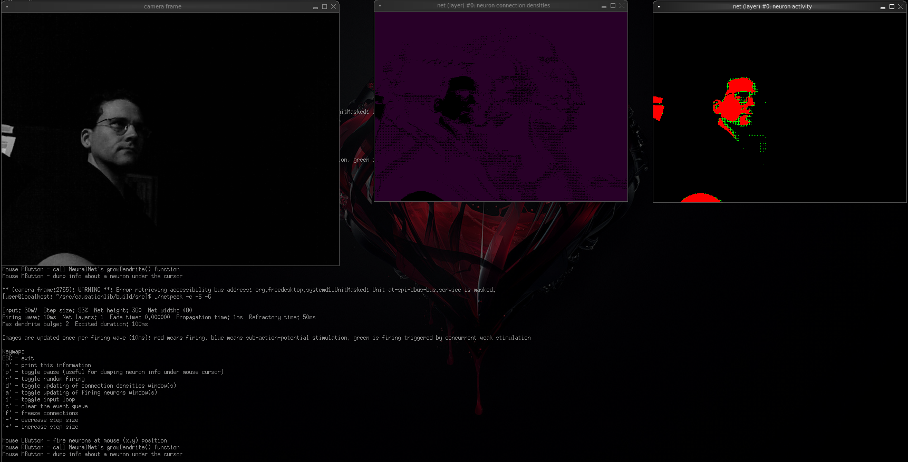

# causationlib
This is a collection of simulations.  Usefulness is neither guaranteed nor provided; a deeper understanding on the part of the author is, however, selfishly maximized with no concern whatsoever for any other parameters.

The neural net code is designed to mimic very simple neurophysiology, not implement established AI algorithms; however, it ignores many forces that influence real biology, and the complexity of modeling neurotransmission is not likely to be addressed anytime soon.

### What's with the name?
I'm playing with causation, and the pieces are a library.  And that's about it.

### Required
If for some reason you want to run the code here, you'll need:
 - CMake
 - OpenCV
 - g++ or an equivalent C++ compiler

### Optional
If you want to grab image frames from a webcam and use that as input to a neural net (using the _netpeek_ executable), you'll also need:
 - any attached camera with drivers OpenCV can utilize

If you have difficulty with the neuron activity windows when running the _netpeek_ executable, the issue is probably the fade time: use the _-f_ argument to set the amount of prior activity that's displayed (in seconds.)
